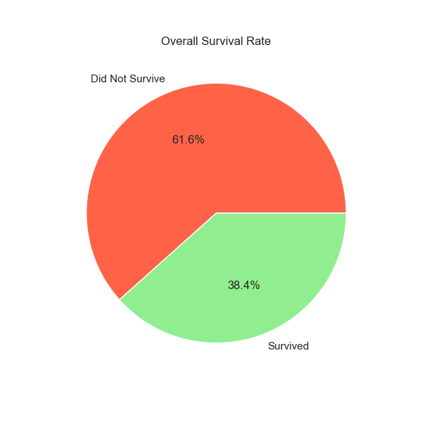
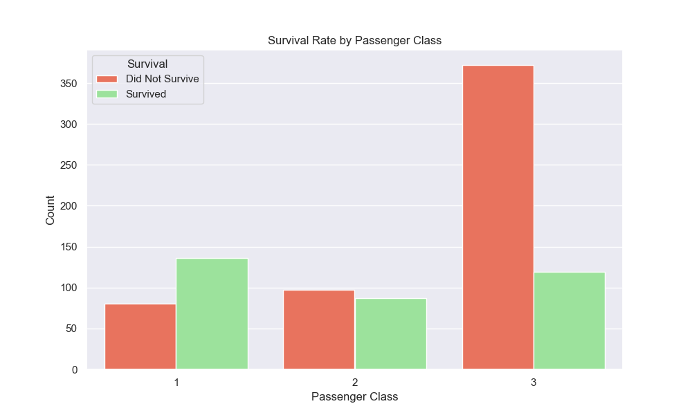
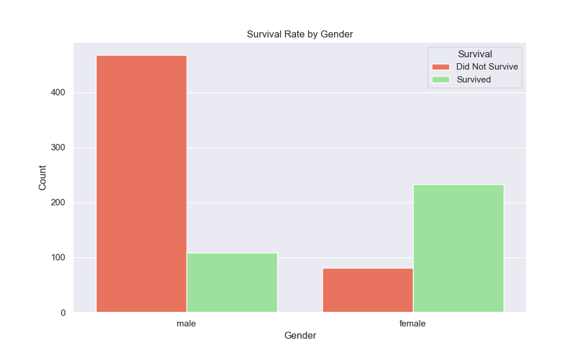
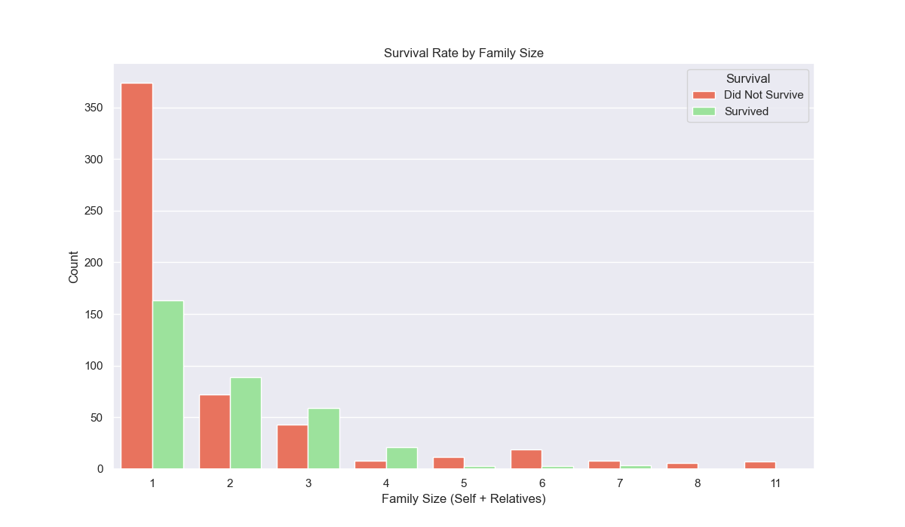

# 🚢 Data Experimentation: Titanic Survival Analysis

## Project Overview
This project performs an **Exploratory Data Analysis (EDA)** on the historical Titanic passenger dataset. The goal is to analyze survival trends and visualize the complex relationship between a passenger's attributes (Class, Gender, Age, and Family Size) and their probability of survival. This project follows a fundamental data science workflow, from data acquisition and cleaning through visualization and presentation.

### Dataset Source
* **Source:** Kaggle: Titanic - Machine Learning from Disaster
* **File Used:** `titanic.csv`

***

## 📊 Key Findings & Visualizations

This table summarizes the core questions asked and the major insights found in the data:

| Finding | Insight | Visualization |
| :--- | :--- | :--- |
| **Overall Survival Rate** | Only **38.4%** of the passengers in the dataset survived. |  |
| **Passenger Class** | **1st Class** passengers had a significantly higher chance of survival than those in 3rd Class. |  |
| **Gender** | **Female passengers** had a far higher survival rate than male passengers (aligning with "women and children first" protocol). |  |
| **Family Size** | Passengers in **small families (Size 2-4)** had the best survival rate, while those alone or in large groups fared worst. |  |

***

## 🛠️ Tools Used
* **Python 3**
* **Pandas:** For data loading, exploration, and manipulation (cleaning missing 'Age' and 'Cabin' values).
* **Matplotlib & Seaborn:** For data visualization and statistical plotting.
